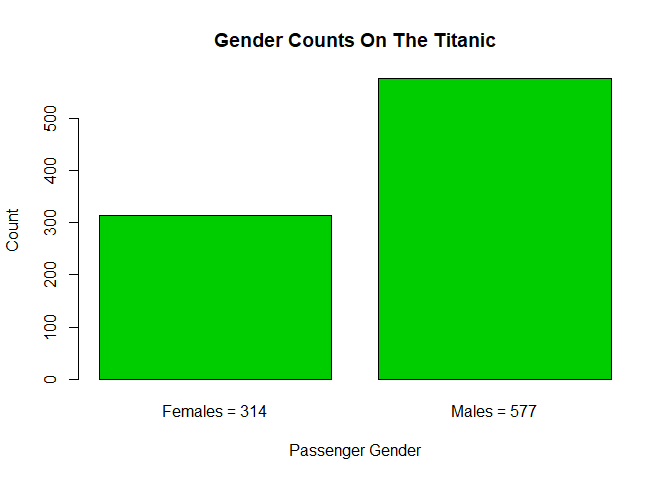
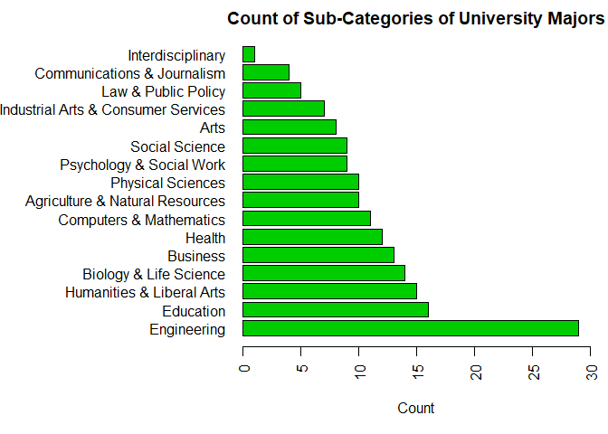

```r
knitr::opts_chunk$set(echo = TRUE)
```

## Question 1
GitHub Cloning (20 points): Using Git, clone the following GitHub repository to
your local machine: https://github.com/caesar0301/awesome-public-datasets. In
RMarkdown, please show the code (commented out, as it’s not R syntax) that you
used to create a new directory, navigate to the appropriate directory, and clone the
repository to it. One Git command per line, please.

|       <b>ANSWER:</b>
|
|               Starting from the C:/ directory
|               $ mkdir GIT_Repositories
|               $ cd git_repositories
|               $ mkdir 6306_Unit_3_HW
|               $ cd 6306_Unit_3_HW
|               $ git clone https://github.com/caesar0301/awesome-public-datasets
|
|
## Question 2: 
Data Summary (20 points): From this aforementioned cloned repo, please extract
titanic.csv.zip. To be clear, this does not have to be done in Git or command line.

|
## Question 2A: 
In R, please read in titanic.csv via either read.table() or read.csv(), assigning it to
df. This dataset follows the passengers aboard the Titanic, including their fees
paid, rooms rented, and survivorship status.

|


```r
df=read.csv("C:\\GIT_Repositories\\6306_Unit_3_HW\\awesome-public-datasets\\Datasets\\titanic\\titanic.csv", header=TRUE, sep=",", stringsAsFactors=FALSE)
```

|
## Question 2B: 
Output the respective count of females and males aboard the Titanic. Plot the
frequency of females and males. Be sure to give an accurate title and label the axes.

```r
barplot(table(df$Sex), xlab="Passenger Gender", ylab="Count", names.arg=c("Females = 314", "Males = 577"), main="Gender Counts On The Titanic", col=3)
```

<!-- -->

|
## Question 2C: 
Please use one apply function (to review: swirl() modules 11, 12) to output the
means of Age, Fare, and Survival. Make sure the output is a real number for
all three means.

```r
Age_Fare_Survived_mean=lapply(df[, c("Age", "Fare", "Survived")], mean, na.rm=TRUE)
Age_Fare_Survived_mean
```

```
## $Age
## [1] 29.69912
## 
## $Fare
## [1] 32.20421
## 
## $Survived
## [1] 0.3838384
```

## Question 3: 
Function Building (30 points): You research sleep and just got your first data set. Later,
you’ll have another dataset with the same column names, so you want to create a helper
function that you can analyze this dataset and the next. Load sleep_data_01.csv (found at
http://talklab.psy.gla.ac.uk/L1_labs/lab_1/homework/index.html). Questions 3A through 3D
should be answered in function(x){}. 3E can be outside of the function.

```r
sleep_data=(read.csv(url("http://talklab.psy.gla.ac.uk/L1_labs/lab_1/homework/sleep_data_01.csv"), header=TRUE, sep=",", stringsAsFactors=FALSE))
```
|


```r
ds_helper=function(type, dataset, col, rpt_obj, funk, df_flds, rnd)
{
  #################################################################################################
    #CREATED BY: Karl J. Jurek
    #CREATION DATE: 25 Nov 2018
    #LAST UPDATED: 25 Nov 2018
    #types are:
      #'data' - creates objects based on the function that is passed in
      #'report' - creates a simple report based on the previous created objects
    #dataset is the dataset that is to be used
    #col is the specific column to be accessed in the data set
    #funk is the function to be called
      #built in functions, such as 'median', can be passed individually or
      #if you want to pass in two or more functions to create a vector it can do that as well
        #EXAMPLE:  
          #rses_mean_and_sd=ds_helper(dataset=sleep_data, col="RSES", funk=c(mean,sd))
          #results in:  rses_mean_and_sd equal to [1] 18.114943  6.176522
    #report allows for three options using the 'funk' object
      #make - will create the report data field based on predetermined objects
        #fnk_report - the dataframe that will be passed back with the desired data
        #df_fields - the object's values desired in the report
      #rename - will rename the columns of the report based on the values in the 'df_fields' object 
        #rpt_obj - the report data frame that the names are going to be changes on
        #df_flds - the new column names      
      #round - will round the values in the report based on the value passed in the 'rnd' object
        #rpt_obj - the report data frame whose values are going to be rounded
        #rnd - the number of decimals to round the values in the report
  #################################################################################################
  
  if (type=="data")
  {
    #creates an object based on the length(size) of the values in the 'funk' variable
    result=c(length(funk))
    if (length(funk)<1)
    {
      #some error message - not added yet KJJ 11/25/2018
    }
    else
    {
      if (length(funk)==1)
      {
        #performs the function that is passed
        result=funk(dataset[, col], na.rm=TRUE)
      }
      else
      {
        #if the funk object has more than one function to be performed it will loop through each
        #function and place the results in one vector
        for (i in 1:length(funk))
        {
          result[i]=funk[[i]](dataset[, col], na.rm=TRUE)
        }
      }
      return(result)
    }
  }
  else if (type=="report")
  {
    #this will create a data frame based on the values of the objects passed
    if (funk=="make")
    {
      #creates a data frame based on the number of objects passed 
      fnk_report=data.frame(length(df_flds))
      
      #adds the values of the objects that were passed into the data frame
      for (i in 1:length(df_flds))
      {
        fnk_report[i]=data.frame(df_flds[i])
      }
      
      return(fnk_report)
      
    }
    else if (funk=="rename")
    {
      #renames the column names for the data frame that was passed in with the 
      #values passed into df_flds 
      names(rpt_obj)=df_flds
      
      return(rpt_obj)
    }
    else if (funk=="round")
    {
      
      #rounds any values of the passed data frame to the number of decimals indicated in 'rnd'
      rpt_obj=round(rpt_obj, digits=rnd)
      
      return(rpt_obj)
    }
  }
}
```

|
## Question 3A: 
Create objects for the median Age, the minimum and maximum Duration of sleep, and
the mean and standard deviation of the Rosenberg Self Esteem scale (RSES). You
may need to specify a few options like in Problem 2 and live session.

|

```r
age_median=ds_helper(type="data", dataset=sleep_data, col="Age", funk=median)
age_median
```

```
## [1] 14
```

```r
dur_min=ds_helper(type="data", dataset=sleep_data, col=15, funk=min)
dur_min
```

```
## [1] 4
```

```r
dur_max=ds_helper(type="data", dataset=sleep_data, col=15, funk=max)
dur_max
```

```
## [1] 11
```

```r
rses_mean=ds_helper(type="data", dataset=sleep_data, col="RSES", funk=mean)
rses_mean
```

```
## [1] 18.11494
```

```r
rses_sd=ds_helper(type="data", dataset=sleep_data, col="RSES", funk=sd)
rses_sd
```

```
## [1] 6.176522
```

```r
rses_mean_and_sd=ds_helper(type="data", dataset=sleep_data, col="RSES", funk=c(mean,sd))
rses_mean_and_sd
```

```
## [1] 18.114943  6.176522
```

## Question 3B: 
Create a data.frame object called report: it should consist of the median age, the RSES
mean and standard deviation respectively divided by five (since there are five
questions and these scores are summed), and the range of Duration (the statistical
definition of range; it should be a single number.)

|

```r
report=ds_helper(type="report", funk="make", df_flds=c(age_median, rses_mean/5, rses_sd/5, dur_max-dur_min))
report
```

```
##   length.df_flds. df_flds.i. df_flds.i..1 df_flds.i..2
## 1              14   3.622989     1.235304            7
```

## Question 3C: 
Change the column names of this data.frame to MedianAge, SelfEsteem, SE_SD, and
DurationRange.

|

```r
new_names=c("MedianAge", "SelfEsteem", "SE_SD", "DurationRange" )
report=ds_helper(type="report", funk="rename", rpt_obj=report, df_flds=new_names)
report
```

```
##   MedianAge SelfEsteem    SE_SD DurationRange
## 1        14   3.622989 1.235304             7
```

## Question 3D: 
Round the report to at most 2 digits: leave this as the closing line to the function.
|

```r
report_round1=ds_helper(type="report", funk="round", rpt_obj=report, rnd=1)
report_round1
```

```
##   MedianAge SelfEsteem SE_SD DurationRange
## 1        14        3.6   1.2             7
```

```r
report_round2=ds_helper(type="report", funk="round", rpt_obj=report, rnd=2)
report_round2
```

```
##   MedianAge SelfEsteem SE_SD DurationRange
## 1        14       3.62  1.24             7
```

## Question 3E: 
Finally, run the function on your sleep data to show the output.

|       <b>ANSWER:</b>
|               See results from Questions 3A-3D.
|
## Question 4: 
FiveThirtyEight Data (30 points): Navigate on GitHub to
https://github.com/rudeboybert/fivethirtyeight and read README.md. It will include
everything you need.

## Question 4A:
Install the fivethirtyeight package.


```r
install.packages("fivethirtyeight", dependencies=TRUE, repos="http://cran.us.r-project.org")
```

```
## Installing package into 'C:/Users/kjjur/Documents/R/win-library/3.5'
## (as 'lib' is unspecified)
```

```
## package 'fivethirtyeight' successfully unpacked and MD5 sums checked
## 
## The downloaded binary packages are in
## 	C:\Users\kjjur\AppData\Local\Temp\RtmpOKfuyo\downloaded_packages
```

```r
library(fivethirtyeight)
data(package="fivethirtyeight")
```

|
## Question 4B:
In the listing of Data sets in package ‘fivethirtyeight,’ assign the 22nd data set to an
object ‘df538.’


```r
df538=college_recent_grads
head(df538)
```

```
##   rank major_code                                     major major_category
## 1    1       2419                     Petroleum Engineering    Engineering
## 2    2       2416            Mining And Mineral Engineering    Engineering
## 3    3       2415                 Metallurgical Engineering    Engineering
## 4    4       2417 Naval Architecture And Marine Engineering    Engineering
## 5    5       2405                      Chemical Engineering    Engineering
## 6    6       2418                       Nuclear Engineering    Engineering
##   total sample_size   men women sharewomen employed employed_fulltime
## 1  2339          36  2057   282  0.1205643     1976              1849
## 2   756           7   679    77  0.1018519      640               556
## 3   856           3   725   131  0.1530374      648               558
## 4  1258          16  1123   135  0.1073132      758              1069
## 5 32260         289 21239 11021  0.3416305    25694             23170
## 6  2573          17  2200   373  0.1449670     1857              2038
##   employed_parttime employed_fulltime_yearround unemployed
## 1               270                        1207         37
## 2               170                         388         85
## 3               133                         340         16
## 4               150                         692         40
## 5              5180                       16697       1672
## 6               264                        1449        400
##   unemployment_rate p25th median  p75th college_jobs non_college_jobs
## 1        0.01838053 95000 110000 125000         1534              364
## 2        0.11724138 55000  75000  90000          350              257
## 3        0.02409639 50000  73000 105000          456              176
## 4        0.05012531 43000  70000  80000          529              102
## 5        0.06109771 50000  65000  75000        18314             4440
## 6        0.17722641 50000  65000 102000         1142              657
##   low_wage_jobs
## 1           193
## 2            50
## 3             0
## 4             0
## 5           972
## 6           244
```

|
## Question 4C:
Use a more detailed list of the data sets to write out the URL in a comment to the
related news story.


```r
install.packages('rvest', dependencies=TRUE, repos="http://cran.us.r-project.org")
```

```
## Installing package into 'C:/Users/kjjur/Documents/R/win-library/3.5'
## (as 'lib' is unspecified)
```

```
## package 'rvest' successfully unpacked and MD5 sums checked
## 
## The downloaded binary packages are in
## 	C:\Users\kjjur\AppData\Local\Temp\RtmpOKfuyo\downloaded_packages
```

```r
library('rvest')
```

```
## Loading required package: xml2
```

```r
url='https://cran.r-project.org/web/packages/fivethirtyeight/vignettes/fivethirtyeight.html'
webpage=read_html(url)
#Select the destination using the 'Selector Gadget' tool
ref_html_nodes=html_nodes(webpage, ".uri")
article_links=html_text(ref_html_nodes)
print(article_links[22])
```

```
## [1] "http://fivethirtyeight.com/features/the-economic-guide-to-picking-a-college-major/"
```

|
## Question 4D:
Using R command(s), give the dimensions and column names of this data frame.


```r
dim(df538)
```

```
## [1] 173  21
```

```r
#NOTE: The dimensions of the dataframe are also listed in the structure information
str(df538)
```

```
## Classes 'tbl_df', 'tbl' and 'data.frame':	173 obs. of  21 variables:
##  $ rank                       : int  1 2 3 4 5 6 7 8 9 10 ...
##  $ major_code                 : int  2419 2416 2415 2417 2405 2418 6202 5001 2414 2408 ...
##  $ major                      : chr  "Petroleum Engineering" "Mining And Mineral Engineering" "Metallurgical Engineering" "Naval Architecture And Marine Engineering" ...
##  $ major_category             : chr  "Engineering" "Engineering" "Engineering" "Engineering" ...
##  $ total                      : int  2339 756 856 1258 32260 2573 3777 1792 91227 81527 ...
##  $ sample_size                : int  36 7 3 16 289 17 51 10 1029 631 ...
##  $ men                        : int  2057 679 725 1123 21239 2200 2110 832 80320 65511 ...
##  $ women                      : int  282 77 131 135 11021 373 1667 960 10907 16016 ...
##  $ sharewomen                 : num  0.121 0.102 0.153 0.107 0.342 ...
##  $ employed                   : int  1976 640 648 758 25694 1857 2912 1526 76442 61928 ...
##  $ employed_fulltime          : int  1849 556 558 1069 23170 2038 2924 1085 71298 55450 ...
##  $ employed_parttime          : int  270 170 133 150 5180 264 296 553 13101 12695 ...
##  $ employed_fulltime_yearround: int  1207 388 340 692 16697 1449 2482 827 54639 41413 ...
##  $ unemployed                 : int  37 85 16 40 1672 400 308 33 4650 3895 ...
##  $ unemployment_rate          : num  0.0184 0.1172 0.0241 0.0501 0.0611 ...
##  $ p25th                      : num  95000 55000 50000 43000 50000 50000 53000 31500 48000 45000 ...
##  $ median                     : num  110000 75000 73000 70000 65000 65000 62000 62000 60000 60000 ...
##  $ p75th                      : num  125000 90000 105000 80000 75000 102000 72000 109000 70000 72000 ...
##  $ college_jobs               : int  1534 350 456 529 18314 1142 1768 972 52844 45829 ...
##  $ non_college_jobs           : int  364 257 176 102 4440 657 314 500 16384 10874 ...
##  $ low_wage_jobs              : int  193 50 0 0 972 244 259 220 3253 3170 ...
```

|
## Question 5:
Data Summary (30 points): Use your newly assigned data frame from question 4 for
this question.

|
## Question 5A1:
Write an R command that gives you the column names of the data frame.


```r
#displays the column names in the 'df538' dataframe
colnames(df538)
```

```
##  [1] "rank"                        "major_code"                 
##  [3] "major"                       "major_category"             
##  [5] "total"                       "sample_size"                
##  [7] "men"                         "women"                      
##  [9] "sharewomen"                  "employed"                   
## [11] "employed_fulltime"           "employed_parttime"          
## [13] "employed_fulltime_yearround" "unemployed"                 
## [15] "unemployment_rate"           "p25th"                      
## [17] "median"                      "p75th"                      
## [19] "college_jobs"                "non_college_jobs"           
## [21] "low_wage_jobs"
```

|
## Question 5A2:
Right after that, write one that counts the number of columns but not rows. 
Hint: The number should match one of your numbers in Question 4d for dimensions.


```r
#displays the count of the number of columns in the 'df538' dataframe
ncol(df538)
```

```
## [1] 21
```

|
## Question 5B:
Generate a count of each unique major_category in the data frame. I recommend using
libraries to help. To be clear, this should look like a matrix or data frame containing
the major_category and the frequency it occurs in the dataset. Assign it to
major_count.


```r
#Gives then frequency of each value in the df538$major_category and places it in a dataframe called major_count
major_count=as.data.frame(table(df538$major_category))
#displays the dataframe 'major_count' data
major_count
```

```
##                                   Var1 Freq
## 1      Agriculture & Natural Resources   10
## 2                                 Arts    8
## 3               Biology & Life Science   14
## 4                             Business   13
## 5          Communications & Journalism    4
## 6              Computers & Mathematics   11
## 7                            Education   16
## 8                          Engineering   29
## 9                               Health   12
## 10           Humanities & Liberal Arts   15
## 11 Industrial Arts & Consumer Services    7
## 12                   Interdisciplinary    1
## 13                 Law & Public Policy    5
## 14                   Physical Sciences   10
## 15            Psychology & Social Work    9
## 16                      Social Science    9
```

|
## Question 5C:
To make things easier to read, put par(las=2) before your plot to make the text
perpendicular to the axis. Make a barplot of major_count. Make sure to label the title
with something informative (check the vignette if you need), label the x and y axis, and
make it any color other than grey. Assign the major_category labels to their respective
bar. Flip the barplot horizontally so that bars extend to the right, not upward. All of
these options can be done in a single pass of barplot(). Note: It’s okay if it’s wider than
the preview pane.


```r
#renaming the first column in the major_count object
names(major_count)=c("Majors", "Freq")
#ordering the Frequency from lowest to highest
new_order=major_count[order(major_count$Freq, decreasing=TRUE),]
#assigning the major names for the y-axis label of the bar plot
major_names=new_order$Majors
#setting the labels to horizontal
par(las=2)
#setting the margins
par(mar=c(5,14,2,1))
#assigning the title to be used in the barplot
title="Count of Sub-Categories of University Majors"
#assigning the x-axis label to be used in the barplot
x_label="Count"
#assigning the y-axis label if it was to be used in the barplot
y_label="Major Categories"
barplot(new_order$Freq, horiz=TRUE, names.arg=major_names, main=title, xlab=x_label, xlim=c(0,30), col=3)
```

<!-- -->

|
## Question 5D:
Write the fivethirtyeight data to a csv file. Make sure that it does not have row labels.


```r
#Creates a .csv file with the information from the 'new_order' dataframe in the working directory
write.csv(new_order, file="Count_of_Major_Categories.csv", row.names=FALSE, na="NA")
```

|
## Question 6:
Codebook (30 points):

|
## Question 6A:
Start a new repository on GitHub for your SMU MSDS homework. On your local
device, make sure there is a directory for Homework at the minimum; you are
welcome to add whatever you would like to this repo in addition to your requirements
here.

|       <b>ANSWER:</b>
|               https://github.com/kjurekSMU/Homework/tree/2018-11-26_HW_Start/6306_HW/6306_Unit_3_HW

|
## Question 6B:
Create a README.md file which explains the purpose of the repository, the topics
included, the sources for the material you post, and contact information in case of
questions. Remember, the one in the root directory should be general. You are
welcome to make short READMEs for each assignment individually in other folders.

|       <b>ANSWER:</b>
|               https://github.com/kjurekSMU/Homework/blob/2018-11-26_HW_Start/6306_HW/6306_Unit_3_HW/README.md

## Question 6C:
In one (or more) of the nested directories, post your RMarkdown script, HTML file,
and data from ‘fivethirtyeight.’ Make sure that in your README or elsewhere that
you credit fivethirtyeight in some way.

|       <b>ANSWER:</b>
|               https://github.com/kjurekSMU/Homework/tree/2018-11-26_HW_Start/6306_HW/6306_Unit_3_HW

## Question 6D:
In your RMarkdown script, please provide the link to this GitHub so the grader can see
it.

|       <b>ANSWER:</b>
|               https://github.com/kjurekSMU/Homework/tree/2018-11-26_HW_Start/6306_HW/6306_Unit_3_HW
|
|
|
